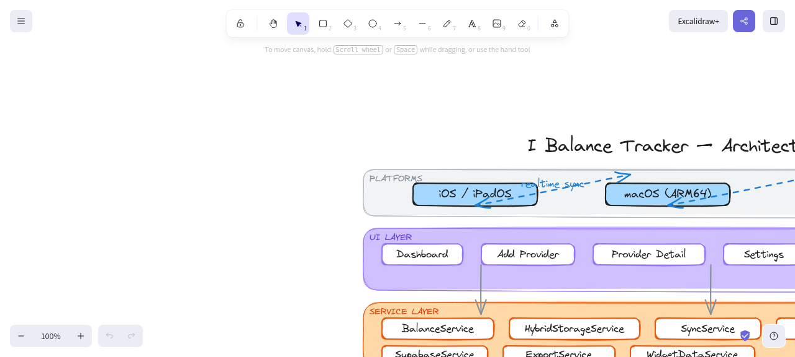

# AI Balance Tracker

> Securely monitor credits, usage, and funds across all your AI providers in a unified dashboard.

[](https://flutter.dev)
[](https://apple.com/ios)
[](LICENSE)
|[](https://github.com/jphermans/ai-balance-tracker/releases)
[](https://apple.com/macos)
[](https://jphermans.github.io/ai-balance-tracker)

## Features

- **Unified Dashboard** — View balances from all your AI providers in one place
- **Auto-Refresh on Launch** — Balances load automatically when the app starts
- **Web Version** — Full Flutter web build available (shared_preferences storage, CSV text export, no PIN on web)
- **8 providers with full balance tracking** — OpenAI, Anthropic, DeepSeek, OpenRouter, Together AI, SiliconFlow, Moonshot, MiniMax
- **22 providers total** — 14 use key validation
- **Spending History Chart** — 7/30/90-day balance snapshots with interactive line chart and touch tooltips
- **CSV Export** — Export provider data and spending history via share sheet
- **Color-Coded Provider Cards** — Green/orange/red balance threshold indicators
- **App Banner** — Full-width JPHsystems banner image on about screen
- **PIN Lock** — Optional 4-digit PIN (iOS/macOS only, disabled on web)
- **Secure Storage** — API keys in iOS Keychain; PBKDF2 PIN hashing; AES-256-GCM cloud encryption
- **About Screen** — App info, tech stack, features list, GitHub links
- **Dark & Light Mode** — Material 3 with automatic/system theme switching
- **Provider Adapters** — Clean architecture: add new providers by implementing `AIProvider`
- **Custom App Icon** — AI-themed neural network icon with gradient purple/blue palette
- **Unsigned IPA in CI** — Every push produces a downloadable IPA for sideloading
- **Developer Mode** — View raw API responses + endpoint URL per provider (always expanded on detail screen)
- **Model Browser** — Browse 50+ models with pricing, context window, and capabilities across all providers
- **Cross-Device Sync (Supabase)** — Sync provider configs between iOS and macOS via Supabase realtime. Enter credentials in Settings → restart app to connect.
- **macOS Desktop App** — Native macOS build with resizable window (min 800×600) and custom app icon
- **Balance Not Supported Banner** — Cards clearly indicate when a provider only supports key validation
- **macOS Keyboard PIN** — Type your PIN on desktop using physical keyboard (0-9 + backspace). Touch-only on iOS/iPadOS.

## Supported Providers

| Provider | Balance API | Key Validation |
|----------|:-----------:|:--------------:|
| OpenAI | ✅ | ✅ |
| Anthropic | ✅ | ✅ |
| DeepSeek | ✅ | ✅ |
| OpenRouter | ✅ | ✅ |
| Together AI | ✅ | ✅ |
| SiliconFlow | ✅ | ✅ |
| Kimi (Moonshot) | ✅ | ✅ |
|| Qwen (Alibaba) | ❌ | ✅ |
|| Groq | ❌ | ✅ |
|| Google AI Studio | ❌ | ✅ |
| xAI | ❌ | ✅ |
| Cohere | ❌ | ✅ |
| Mistral AI | ❌ | ✅ |
| Fireworks AI | ❌ | ✅ |
| Perplexity | ❌ | ✅ |
| Novita AI | ❌ | ✅ |
| Cerebras | ❌ | ✅ |
| Replicate | ❌ | ✅ |
| Hugging Face | ❌ | ✅ |
| SambaNova | ❌ | ✅ |
| AI21 Labs | ❌ | ✅ |
|| MiniMax | ✅ | ✅ |

✅ Full balance tracking &nbsp;&nbsp; ❌ Key validation only

## Architecture

```
lib/
├── main.dart                    # Entry point
├── app.dart                     # MaterialApp + PIN unlock check + routing
├── screens/
│   ├── dashboard_screen.dart    # Provider cards, search, pull-to-refresh
│   ├── provider_detail_screen.dart  # Stats, usage chart, raw API, model browser
│   ├── settings_screen.dart     # Theme, PIN lock, provider management
│   ├── add_provider_screen.dart # Searchable provider list + API key entry
│   ├── pin_unlock_screen.dart   # Full-screen PIN entry with shake animation
│   ├── pin_setup_screen.dart    # Full-screen PIN creation + confirmation
│   └── about_screen.dart        # App info, tech stack, links, license
├── models/
│   ├── balance_info.dart        # Balance data model (supportsBalance flag)
│   ├── balance_snapshot.dart     # Timestamped balance for spending history
│   ├── usage_info.dart          # Usage statistics model
│   ├── model_info.dart          # Model metadata (pricing, context, capabilities)
│   └── provider_config.dart     # Provider configuration + 22 provider types
├── providers/
│   ├── ai_provider.dart         # Abstract base class
│   ├── openai_provider.dart     # /v1/dashboard/billing/credit_grants
│   ├── anthropic_provider.dart  # /v1/organizations/{id}/usage
│   ├── deepseek_provider.dart   # /user/balance
│   ├── openrouter_provider.dart # /api/v1/credits
│   ├── groq_provider.dart       # Key validation via /models
│   ├── together_provider.dart   # /v1/billing
│   ├── siliconflow_provider.dart # /v1/user/info
│   ├── moonshot_provider.dart   # Kimi api.moonshot.ai/v1/users/me/balance
│   ├── qwen_provider.dart       # Qwen dashscope /compatible-mode/v1/models
│   ├── minimax_provider.dart    # MiniMax api.minimax.io X-Api-Key auth
│   ├── stub_provider.dart       # Key validation for 10 other providers
│   └── provider_registry.dart   # Provider → adapter mapping
├── services/
│   ├── secure_storage_service.dart  # Keychain-backed credential storage
│   ├── balance_service.dart         # Parallel balance fetching
│   ├── history_service.dart         # Balance snapshots + spending chart data
│   ├── widget_data_service.dart     # Writes balance to App Group UserDefaults
│   └── pin_service.dart             # PIN hash/verify/remove (Keychain)
├── state/
│   └── app_state.dart           # Riverpod: providers, balances, theme, PIN
├── theme/
│   └── app_theme.dart           # Material 3 light/dark iOS-inspired themes
└── widgets/
    ├── splash_screen.dart       # Branded launch screen with animations
    ├── provider_card.dart       # Balance card with not-supported banner
    ├── glass_card.dart          # Liquid glass card with BackdropFilter blur
    ├── pin_pad.dart             # Shared numeric PIN keypad (iOS style)
    └── pin_setup_dialog.dart    # Create/confirm PIN (legacy bottom sheet)
```

### iOS Widget Extension (native)

```
ios/BalanceWidget/
├── Info.plist                          # Widget extension metadata
├── BalanceWidgetBundle.swift           # @main WidgetBundle entry point
├── BalanceWidget.swift                 # WidgetConfiguration + SwiftUI view
├── BalanceProvider.swift               # TimelineProvider reading App Group
└── BalanceWidget.entitlements          # App Group capability
```

**Data flow:** Flutter → MethodChannel → App Group UserDefaults → Widget reads on timeline refresh

> ⚠️ **Widget requires a paid Apple Developer account.** Free provisioning profiles don't support app extensions. The IPA built by CI does NOT include the widget. To enable it locally: add the `BalanceWidgetExtension` target to the Xcode scheme via `ios/add_widget_target.py`.

### macOS (native desktop)

```
macos/
├── Runner/
│   ├── MainFlutterWindow.swift    # Fixed 800×600 non-resizable window
│   ├── AppDelegate.swift          # macOS app delegate
│   ├── Info.plist                 # App metadata
│   └── Configs/                   # Build configs (Debug, Release)
└── Runner.xcodeproj/              # Xcode project
```

**Window:** 800×600 fixed size, centered on screen, no resize, vertical scroll only.

## Screens

| Screen | Route | Description |
|--------|-------|-------------|
| Dashboard | `/` | Provider cards, search, pull-to-refresh balances |
| Provider Detail | `/provider/:id` | Stats, usage chart, raw API, model browser |
| Add Provider | `/add-provider` | Searchable provider list + API key entry |
| Settings | `/settings` | Theme, PIN lock, provider list, data management |
| PIN Setup | `/pin-setup` | Full-screen 4-digit PIN creation with confirmation |
| PIN Unlock | (gate) | Full-screen unlock with shake on wrong PIN |
| About | `/about` | App info, tech stack, features, links, license |

### Adding a New Provider

1. Create a class in `lib/providers/` extending `AIProvider`
2. Implement `getBalance()` and `getUsage()`
3. Add the type to `ProviderType` enum in `provider_config.dart`
4. Register it in `ProviderRegistry.create()`
5. Set `hasBalanceEndpoint` to `true` if the provider has a balance API

```dart
class MyProvider extends AIProvider {
  MyProvider(super.config);

  @override
  Map<String, String> get headers => {
    'Authorization': 'Bearer ${config.apiKey}',
  };

  @override
  Future<BalanceInfo> getBalance() async {
    // Call provider's balance API
  }

  @override
  Future<UsageInfo> getUsage() async {
    // Call provider's usage API
  }
}
```

## Architecture Diagram



> Open `assets/architecture.excalidraw` at [excalidraw.com](https://excalidraw.com) to view/edit the interactive diagram (drag & drop the file onto the canvas).

## Tech Stack

| Layer | Technology |
|-------|-----------|
| Framework | Flutter 3.44+ (Dart) |
| State | Riverpod |
| Navigation | GoRouter |
| Cloud Sync | Supabase (PostgreSQL + Realtime) |
| Credential Storage | flutter_secure_storage (iOS Keychain), SharedPreferences (macOS/web) |
| Local Storage | SharedPreferences |
| Security | pointycastle (PBKDF2-HMAC-SHA256, AES-256-GCM) |
| HTTP Client | dart:http |
| Offline Detection | connectivity_plus |
| Charts | fl_chart |
| Export | CSV + share_plus |
| CI/CD | GitHub Actions (unsigned IPA + macOS .app) |
| Design | Material 3 liquid glass (BackdropFilter blur) |

## Web Version

### Quick Start (Local)

```bash
cd ai-balance-tracker
flutter pub get
flutter run -d chrome          # Development with hot reload
flutter build web               # Production build → build/web/
```

### Serve Locally

```bash
cd build/web
python3 -m http.server 8080     # Then open http://localhost:8080
```

Or use any static file server (npx serve, etc.)

### Deploy to GitHub Pages

```bash
flutter build web --base-href /ai-balance-tracker/
cd build/web
git init && git checkout -b gh-pages
git add -A && git commit -m "Web deploy"
git push -f origin gh-pages
# Site live at: https://<user>.github.io/ai-balance-tracker/
```

### Web vs Native Differences

| Feature | iOS/macOS | Web |
|---------|-----------|-----|
| Secure storage | Keychain | SharedPreferences (localStorage) |
| PIN lock | ✅ Touch/keyboard | ❌ Disabled |
| CSV export | File share sheet | Text share |
| Supabase sync | ✅ | ✅ |
| All 22 providers | ✅ | ✅ |

**Storage note:** On web, API keys are stored in browser localStorage — not encrypted like iOS Keychain. Only use the web version on trusted devices. Your Supabase config is isolated to your browser — other visitors to the same web app cannot see your saved URL or key.

## Getting Started

### Prerequisites

- Flutter 3.44+
- Xcode 16+ (for iOS builds)
- iOS 17.0+ deployment target
- macOS 13.0+ (for desktop builds)

### Development

```bash
git clone https://github.com/jphermans/ai-balance-tracker.git
cd ai-balance-tracker
flutter pub get
flutter run          # iOS simulator
flutter run -d macos # macOS desktop
flutter run -d <id>  # connected iPhone
```

### Supabase Cloud Sync (optional)

Sync provider configs across iOS and macOS devices via Supabase realtime.
**v1.14+**: configure directly in the app (Settings → Cloud Sync) — no build flags needed.
The app works fully offline without Supabase — cloud sync is opt-in.

**1. Create a free Supabase project**

Go to [database.new](https://database.new/) and create a new project.
Note your **Project URL** and **Publishable key** from Project Settings → API
(look for the key starting with `sb_publishable_` — Supabase may also label it "anon public").

**2. Enable anonymous sign-ins**

In your Supabase dashboard: **Authentication** → **Providers** tab → scroll to the bottom
→ toggle **"Allow anonymous sign-ins"** ON.
(Alternatively: direct link → [Project Auth Providers](https://supabase.com/dashboard/project/_/auth/providers))

**3. Run the database schema**

Open the SQL Editor in your Supabase dashboard and run:

```sql
-- Create the provider configs table
CREATE TABLE provider_configs (
  id              UUID PRIMARY KEY DEFAULT gen_random_uuid(),
  user_id         UUID NOT NULL REFERENCES auth.users(id) ON DELETE CASCADE,
  provider_id     TEXT NOT NULL,
  type            TEXT NOT NULL,
  api_key         TEXT NOT NULL,
  org_id          TEXT,
  account_id      TEXT,
  custom_endpoint TEXT,
  enabled         BOOLEAN NOT NULL DEFAULT true,
  updated_at      TIMESTAMPTZ NOT NULL DEFAULT now(),
  UNIQUE(user_id, provider_id)
);

-- Enable realtime for instant cross-device sync
ALTER PUBLICATION supabase_realtime ADD TABLE provider_configs;

-- Row Level Security: users can only access their own configs
ALTER TABLE provider_configs ENABLE ROW LEVEL SECURITY;
CREATE POLICY "Users manage own configs" ON provider_configs
  FOR ALL USING (auth.uid() = user_id)
  WITH CHECK (auth.uid() = user_id);
```

**3b. MIGRATION (existing projects only — v1.15.0+ cross-device sync)**

If you ran the schema above before v1.15.0, your table has
`UNIQUE(user_id, provider_id)` and an RLS policy that isolates by user.
That breaks cross-device sync because anonymous auth gives each device a
different `user_id`, so each device only sees its own rows (and the
upsert's `onConflict: 'provider_id'` doesn't match the actual unique
constraint, so writes fail).

Run this **once** in the SQL Editor to make the table cross-device:

```sql
-- Drop per-user unique constraint; provider_id is now globally unique
ALTER TABLE provider_configs DROP CONSTRAINT provider_configs_user_id_provider_id_key;

-- Add global unique constraint on provider_id
ALTER TABLE provider_configs ADD CONSTRAINT provider_configs_provider_id_key UNIQUE (provider_id);

-- Replace RLS policy: allow all authenticated (incl. anonymous) users
-- full access to the table. Security model: anyone with the project's
-- publishable key has read/write; per-row encryption (AES-256-GCM keyed
-- off the project credentials) provides defense-in-depth for API keys.
DROP POLICY IF EXISTS "Users manage own configs" ON provider_configs;
CREATE POLICY "Authenticated full access" ON provider_configs
  FOR ALL TO authenticated
  USING (true)
  WITH CHECK (true);
```

After running this, restart every device so it re-fetches with the new
schema. Existing rows will be merged — devices with the same
`provider_id` will see the row from whichever device wrote it most
recently (last-write-wins by `updated_at`).

**4. Configure in the app**

Open the app → Settings → **Cloud Sync** → paste your Project URL and Publishable Key → tap **Save**.
Then **restart the app** — it will connect and sync on next launch.

That's it. No build flags, no `--dart-define`, no GitHub Secrets needed.

To disconnect, tap **Remove** in the Cloud Sync section. Your provider data
stays on the device — only the sync link is removed.

> **For CI builds only:** if you want the unsigned IPA or macOS .app to ship
> with cloud sync pre-configured, set `SUPABASE_URL` and `SUPABASE_ANON_KEY`
> as GitHub Actions secrets. They're passed via `--dart-define` at build time.
> Without them, CI builds run in local-only mode (users configure in-app).

### Firebase Cloud Sync (alternative)

If you prefer Firebase over Supabase, here's how to set it up.
Note: the app ships with Supabase by default — using Firebase requires
swapping dependencies and rewriting `lib/services/sync_service.dart`.

**1. Create a Firebase project**

Go to the [Firebase Console](https://console.firebase.google.com/) and create a new project.
Enable **Cloud Firestore** in the left sidebar → Build → Firestore Database.

**2. Install FlutterFire CLI**

```bash
dart pub global activate flutterfire_cli
```

**3. Configure your Flutter app**

```bash
cd ai-balance-tracker
flutterfire configure
```

This generates `lib/firebase_options.dart` and registers iOS + macOS
apps in your Firebase project. Select both platforms when prompted.

**4. Add Firebase dependencies**

```yaml
# pubspec.yaml
dependencies:
  firebase_core: ^3.0.0
  cloud_firestore: ^5.0.0
  firebase_auth: ^5.0.0
```

**5. Create Firestore security rules**

```javascript
// Firestore Rules
rules_version = '2';
service cloud.firestore {
  match /databases/{database}/documents {
    match /providers/{userId} {
      match /configs/{configId} {
        allow read, write: if request.auth != null
                          && request.auth.uid == userId;
      }
    }
  }
}
```

**6. Configure anonymous auth**

In Firebase Console → Authentication → Sign-in method → enable **Anonymous**.

**7. Initialize Firebase in main.dart**

```dart
import 'package:firebase_core/firebase_core.dart';
import 'package:firebase_auth/firebase_auth.dart';
import 'firebase_options.dart';

void main() async {
  WidgetsFlutterBinding.ensureInitialized();
  await Firebase.initializeApp(options: DefaultFirebaseOptions.currentPlatform);
  await FirebaseAuth.instance.signInAnonymously();
  runApp(const MyApp());
}
```

Firebase config is bundled in `firebase_options.dart` — no dart-defines needed.
The Firestore `snapshots()` stream replaces Supabase's Postgres Changes
for realtime sync. Use `collection('providers').doc(userId).collection('configs')`
as your document structure.

## macOS Desktop Build

The CI builds a single Apple Silicon .app bundle.

### Download

Go to [Actions → Build macOS App](https://github.com/jphermans/ai-balance-tracker/actions/workflows/build-macos.yml) → click the latest run → download `ai-balance-tracker-macos`.

Or grab the latest from [Releases](https://github.com/jphermans/ai-balance-tracker/releases) (tagged builds only):

- `ai-balance-tracker-macos.zip` — Apple Silicon (M1/M2/M3/M4)

### Install

```bash
unzip ai-balance-tracker-macos.zip
mv "AI Balance Tracker.app" /Applications/
xattr -cr "/Applications/AI Balance Tracker.app"
```

### Local build

```bash
flutter build macos --release
open build/macos/Build/Products/Release/
```

## Building & Sideloading the IPA

The CI builds an unsigned IPA on every push. You download it, sign it with your own certificate, and install it on your device.

### Step 1: Download the IPA

Go to [Actions → Build iOS IPA](https://github.com/jphermans/ai-balance-tracker/actions/workflows/build-ipa.yml) → click the latest run → scroll to **Artifacts** → download `ai-balance-tracker-unsigned-ipa`.

### Step 2: Get a Signing Certificate

**If you have an Apple Developer account ($99/year):**
```bash
# Your cert is already in Keychain. List it:
security find-identity -v -p codesigning
# Look for "iPhone Developer: Your Name (TEAMID)"
```

**If you don't have a paid account (free sideloading, 7-day expiry):**
1. Open Xcode → Preferences → Accounts → add your Apple ID
2. Create a new dummy iOS project (any template)
3. Set the bundle ID to `com.jphermans.ai-balance-tracker`
4. Build to your device once — Xcode creates a free provisioning profile
5. Your signing identity is now: `Apple Development: your@email.com (TEAMID)`

Find your identity:
```bash
security find-identity -v -p codesigning
```

### Step 3: Create Entitlements

Create a file `entitlements.plist` (or use the one in `ios/entitlements.plist` from the repo):

```xml
<?xml version="1.0" encoding="UTF-8"?>
<!DOCTYPE plist PUBLIC "-//Apple//DTD PLIST 1.0//EN"
  "http://www.apple.com/DTDs/PropertyList-1.0.dtd">
<plist version="1.0">
<dict>
    <key>application-identifier</key>
    <string>YOUR_TEAM_ID.com.jphermans.ai-balance-tracker</string>
    <key>com.apple.developer.team-identifier</key>
    <string>YOUR_TEAM_ID</string>
    <key>get-task-allow</key>
    <true/>
</dict>
</plist>
```

Replace `YOUR_TEAM_ID` with your actual team ID (find it at [developer.apple.com/account](https://developer.apple.com/account)).

### Step 4: Sign the IPA

```bash
# Unzip the IPA
unzip ai-balance-tracker-unsigned.ipa -d extracted

# Sign the app with your certificate
codesign -fs "iPhone Developer: Your Name (TEAMID)" \
  --entitlements entitlements.plist \
  extracted/Payload/Runner.app

# Verify the signature
codesign -dvvv extracted/Payload/Runner.app

# Re-package into a signed IPA
cd extracted
zip -r ../ai-balance-tracker-signed.ipa Payload/
cd ..
```

### Step 5: Install on Your iPhone

**Option A — Xcode (easiest):**
1. Connect iPhone via USB
2. Xcode → Window → Devices and Simulators
3. Drag the signed `.ipa` onto your device

**Option B — Apple Configurator (Mac App Store, free):**
1. Connect iPhone via USB
2. Drag the signed `.ipa` onto your device in Apple Configurator

**Option C — ios-deploy (command line):**
```bash
brew install ios-deploy
ios-deploy --bundle extracted/Payload/Runner.app
```

**Option D — AltStore / SideStore:**
Use a sideloading tool that handles re-signing automatically.

### Automated Signed Build (optional)

Add these GitHub Secrets for CI to produce a fully signed IPA:

| Secret | How to get it |
|--------|---------------|
| `APPLE_DEVELOPER_CERTIFICATE_BASE64` | `base64 -i ~/Desktop/certificate.p12` |
| `APPLE_DEVELOPER_CERTIFICATE_PASSWORD` | P12 export password |
| `APPLE_PROVISION_PROFILE_BASE64` | `base64 -i ~/Downloads/app.mobileprovision` |
| `APPLE_TEAM_ID` | From [developer.apple.com/account](https://developer.apple.com/account) |

## PIN Lock

The app includes an optional 4-digit PIN lock with a polished setup flow:

- **First launch:** After splash, if no PIN exists → full-screen onboarding PIN setup with skip option
- **Set PIN later:** Settings → Security → Set PIN → full-screen setup page → enter + confirm
- **Remove PIN:** Settings → Security → Remove → enter current PIN in dialog
- **Unlock on return:** Full-screen PIN entry with animated dots and shake on wrong attempts
- **Storage:** PIN hash stored in iOS Keychain via `flutter_secure_storage`

## Security

- API keys and PIN stored in **iOS Keychain** via `flutter_secure_storage`
- PIN is hashed before storage (not plaintext) and protected with exponential-backoff lockout after repeated wrong attempts
- Supabase anon key stored in Keychain on iOS/Android (not plaintext SharedPreferences)
- No credentials in logs or crash reports
- Sensitive values masked in UI
- HTTPS-only API communication

## CI/CD

The `.github/workflows/build-ipa.yml` workflow:

| Job | Trigger | Output |
|-----|---------|--------|
| **Unsigned IPA** | Every push to `main` | `ai-balance-tracker-unsigned.ipa` artifact |
| **Signed IPA** | Push to `main` (requires Apple secrets) | Signed ad-hoc IPA artifact |
| **GitHub Release** | Tag push (`v*`) | Both IPAs + macOS builds attached to release |

The `.github/workflows/build-macos.yml` workflow:

| Job | Trigger | Output |
|-----|---------|--------|
| **macOS (ARM64)** | Every push to `main` | `ai-balance-tracker-macos.zip` |
| **GitHub Release** | Tag push (`v*`) | macOS zip attached |

### Supabase credentials in CI (optional)

CI builds run in local-only mode by default — users configure cloud sync in-app.
To pre-configure a CI build with Supabase, add these GitHub Actions secrets:

- `SUPABASE_URL` — Your Supabase project URL
- `SUPABASE_ANON_KEY` — Your Supabase Publishable key (starts with `sb_publishable_`)

These are baked into the app at build time via `--dart-define`.
End users can still override them from Settings → Cloud Sync.

## Version History

### v3.1.8
- **Sync health check — detect broken Supabase migration from the app** — new `SyncHealthNotifier` queries the `provider_configs` table on startup and checks whether any `provider_id` has rows from multiple different `user_id` values. If so, the old per-user schema is still active and `onConflict: 'provider_id'` upserts are silently failing → no cross-device sync. The app now shows a red warning banner on the dashboard with a "FIX NOW" button that takes the user to Settings.
- **Sync unreachable warning** — if Supabase is configured but unreachable, an orange banner appears instead of silent failure.

### v3.1.7
- **Fix wrong API path display in Raw API Response section** — `provider_detail_screen.dart` `_apiPath()` returned incorrect endpoint paths for several providers. OpenRouter showed `/api/v1/credits` (double `/api/` with base URL), Together showed `/v1/billing` (should be `/v1/billing/cost_details`). Fixed to show correct developer-facing paths.
- **Analyzer cleanup** — removed unused `starPaint` variable in `splash_screen.dart`, unused `_delete()` method in `secure_storage_service.dart`, unused `pin_service.dart` import in `pin_setup_screen.dart`, unnecessary non-null assertion `!` in `dashboard_screen.dart`, unnecessary double underscore `__` in `app_state.dart`, and unnecessary braces in string interpolations in `app.dart` and `model_info.dart`.

### v3.1.6
- **Fix cross-device sync (root cause)** — `EncryptionService` key derivation now uses the Supabase project credentials (URL + publishable key) hashed with SHA-256, instead of the per-device anonymous user_id. **This was the actual blocker for cross-device sync:** anonymous auth gives each device a different `user_id`, so the old key derivation produced a different AES-256 key on every device. Device B could never decrypt rows written by device A (GCM auth tag failed → `tryDecrypt` returned `null` → row silently dropped by `SyncService._fromRow`). Now every device pointing at the same Supabase project derives the same key and can read each other's API keys. The legacy per-user-id derivation is kept as a fallback so locally-written data from older app versions remains decryptable on the device that wrote it. Added two new unit tests: cross-device round-trip with the same project key (succeeds) and isolation between different projects (fails GCM auth). `EncryptionService.initialize(supabaseUrl, publishableKey)` is now called from `main.dart` after Supabase init and before any sync.
- **Reverted v3.1.4 onConflict regression** — `SyncService.upsert()` no longer sends `user_id` in the payload and uses `onConflict: 'provider_id'` again. The v3.1.4 attempt to make the upsert match the old per-user unique constraint actually broke cross-device sync, which is the goal of the v1.15.0 design. The code is now back to the v1.15.0 contract: `provider_id` is the sole unique key, the user must run the migration SQL in step 3b of the README to align their Supabase schema. (The `catchError` log change from v3.1.4 stays — silent failure masking was a real bug.)
- **README: 3b Migration SQL** — added the missing SQL migration that existing projects need to run to make their Supabase table cross-device (drop `UNIQUE(user_id, provider_id)`, add `UNIQUE(provider_id)`, replace RLS policy with `USING (true)`). Previously the v1.15.0 release notes mentioned "run SQL" but never actually shipped the SQL — the user had no way to complete the migration.

### v3.1.5
- **CI: stop double-building on tag push (Option A)** — `build-ipa.yml`, `build-macos.yml`, and `build-web.yml` no longer trigger on `tags: ['v*']`. The build now runs only on `main` push, PR, and manual dispatch. A new `release.yml` listens for the build's `workflow_run` event and, if a `v*` tag points at the same commit SHA, downloads the artifact and creates/updates the GitHub release. Result: **1 build per push instead of 2** — saves ~12-15 min of `macos-14` runner time per release. Web deploys via GitHub Pages on every main push (unchanged).

### v3.1.4
- **Fix Supabase sync for new providers** — `SyncService.upsert()` now sends `user_id` and uses `onConflict: 'user_id,provider_id'` to match the actual composite unique constraint in the `provider_configs` table. Previously, `onConflict: 'provider_id'` referenced a single column that wasn't uniquely indexed, so PostgREST rejected the upsert with a 400 — and the fire-and-forget `catchError` in `HybridStorageService.saveProvider()` silently swallowed it. New providers were visible locally but never reached Supabase, so they disappeared on other devices and after reinstall. Also: `catchError` now logs failures via `debugPrint` so future sync regressions surface in `flutter logs` instead of failing silently.

### v3.1.3
- **Security fixes (issue #43)**
  - **#1 PIN brute-force protection** — exponential backoff lockout after 5 wrong attempts (5s, 30s, 1m, 5m, 15m, 1h, 4h, 24h capped); defensive wipe after 20 consecutive failures; new `PinVerifyResult` enum surfaced in the UI with "Too many attempts. Try again in Xs." messages
  - **#3 Supabase anon key secure storage** — anon key now persisted in iOS Keychain / Android EncryptedSharedPreferences on those platforms (plaintext SharedPreferences was recoverable from disk); SharedPreferences kept as fallback for macOS/web/Linux and auto-cleans on upgrade
  - **#8 Decrypt crash on malformed rows** — `EncryptionService.tryDecrypt()` returns `null` on any failure (bad base64, wrong IV length, GCM auth mismatch) instead of throwing; `SyncService` skips + logs bad rows so a single corrupted Supabase row no longer kills startup; pre-existing GCM buffer-trim bug in `encrypt()` also fixed
- **Test coverage** — added 22 unit tests across the three services (encryption round-trip + failure modes, PIN lockout + reset, anon-key storage + upgrade path). Coverage rose from ~9% of files to ~16%.

### v3.1.2
- **Fix #33** — removed Groq from `balanceTypes` (overrides `supportsBalance=false`); deleted stale `balanceProviders` getter
- **About screen** — expanded tech stack to include all libraries (path_provider, url_launcher, web, intl, flutter_secure_storage)
- **Provider counts** — 8 full balance tracking, 14 key validation (Groq moved to key-validation-only)

### v2.1.2
- **Fix macOS keyboard PIN** — keyboard input was accidentally web-only; now works on macOS/desktop again
- **Fix About screen** — Flutter version 3.38+ → 3.44+
- **CI fix** — revert connectivity_plus 7→6 (isUltraConstrained requires unreleased macOS SDK)

### v2.1.1
- **Dependency upgrades** — csv 6→8, share_plus 10→13, flutter_secure_storage 9→10, fl_chart 0.70→1.2, go_router 14→17 (riverpod held at 2.x — 3.x drops StateNotifier; connectivity_plus held at 6.x — 7.x requires unreleased macOS SDK)

### v2.1.0
- **Flutter 3.44.1** — upgraded from 3.38.5; all CI workflows, README, and wiki updated

### v2.0.3
- **CI web deploy (#42)** — auto-build and deploy web version to GitHub Pages on every push to main and every release tag

### v2.0.2
- **PIN lock disabled on web** — skip PIN setup/unlock screens on web platform (no secure storage)
- Hide PIN settings section in Settings on web

### v2.0.1
- **CI cleanup workflow** — auto-deletes old workflow runs on release, keeping last 5 per workflow

### v2.0.0
- **Web version (#26)** — full Flutter web build with all 23 providers
- dart:io Platform → flutter/foundation kIsWeb/TargetPlatform (6 files fixed)
- CSV export: file share (native) or text share (web)
- PIN lock disabled on web; secure_storage falls back to SharedPreferences
- Web build/serve/deploy instructions in README

### v1.17.0
- **Card tap opens provider website (#27)** — tap a provider card to open its platform in the browser
- Info icon (i) on each card navigates to the detail screen instead
- All 22 providers have website URLs configured in ProviderType
- Snackbar feedback when a provider has no website

### v1.16.1
- **About screen fixes (#25, #28)** — text overflow fixed on small screens (tech items wrap vertically)
- **Wiki link** added to About screen → Links section
- Provider count updated to 23 (9 with balance tracking)

### v1.16.0
- **MiniMax provider** — api.minimax.io with X-Api-Key auth, Anthropic-compatible models endpoint
- 8 MiniMax models with pricing (MiniMax-M3, M2.7, M2.5, M2.1, M2 + highspeed variants)
- No public balance API — key validation only

### v1.15.1
- **Merge logic fix** — realtime merge (cloudWins) now returns only cloud entries instead of preserving stale local-only ghosts. Deleted providers no longer reappear after sync.
- Build number bumped to +36

### v1.15.0
- **Sync doubling fixed (#22)** — removed user_id isolation; provider_id is now the sole unique key in Supabase. Deletes on one device propagate to all devices instead of being blocked by mismatched anonymous user IDs.
- **Cross-device merge fixed** — realtime merge now uses cloud-wins and removes locally-deleted providers that still exist on other devices.
- **macOS keyboard PIN entry (#21)** — type PIN digits on desktop using physical keyboard (0-9, backspace, delete). iOS/iPadOS unchanged.
- **Cross-device sync fixed** — removed per-user filter from Supabase queries
- RLS policy changed to allow all authenticated users (run SQL in Supabase dashboard)
- macOS now sees iPhone's provider records and vice versa

### v1.14.3
- Realtime cloud sync now live — changes from other devices appear instantly
- Anonymous session preserved across restarts (no more new user on each launch)
- Debug logging added for Supabase diagnostics
- Save button logic fixed

### v1.14.2
- Save button disabled when already connected (prevents re-save crash)
- Button also disabled when fields haven't changed
- Cleaned up Supabase reconnect flow — save & restart only

### v1.14.1
- Fix: Supabase singleton dispose crash on reconnect — now uses save & restart flow
- Credentials persist on disk, picked up on next launch
- Removed live reconnection (SDK limitation: can't re-init singleton)

### v1.14.0
- **In-app Supabase config** — URL + anon key text fields in Settings (no build flags needed)
- Config persists across restarts, removable anytime

### v1.13.1
- Raw API response section now **expanded by default** on provider detail screen
- Moonshot currency fixed to **CNY** (was incorrectly USD)
- Moonshot added to providers table (was missing)

### v1.13.0
- **Supabase cloud sync** — provider configs sync between iOS ↔ macOS realtime
- macOS storage fix — SharedPreferences instead of Keychain on unsigned macOS
- macOS window resizable (min 800×600), sandbox disabled
- Firebase setup guide added to README

### v1.12.1
- macOS app icon from iOS source, black screen fix (sandbox disabled)

### v1.12.0
- macOS ARM desktop app, Intel build dropped (runner unavailable)

### v1.11.0
- Liquid glass design system for iOS (BackdropFilter blur, frosted surfaces)

## License

MIT © JPHsystems
